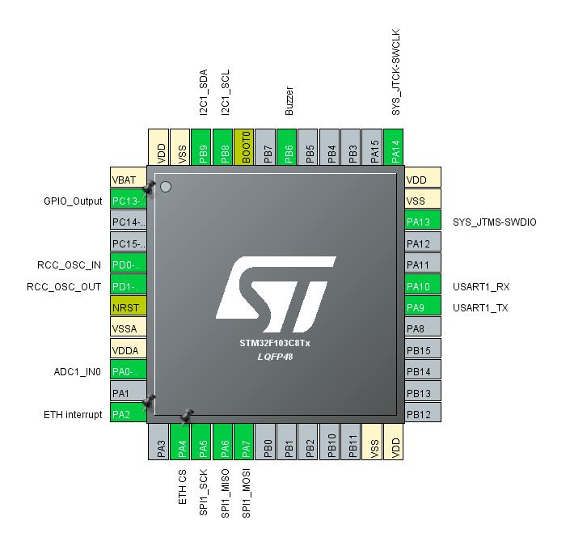

# Weatherware

## STM32 weather station

**********************************************************

Used modules:

Module        | Description 			      	  | Interface 
--------------|-------------------------|-----------
ENC28J60      | Ethernet                | SPI1		   
DHT11         | Relative humidity & temp| GPIO B12	 
DS18B20       | Temperature 				        | GPIO B13	 
GY-BME280     | Atmosphere pressure & temp | I2C1		   
Photoresistor | Lighting				            | GPIO B14  

### Chip pinout:

### Circuit diagram:

